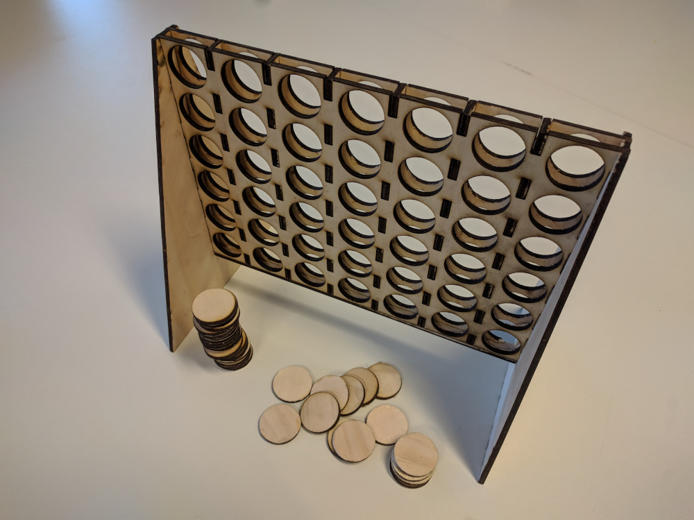
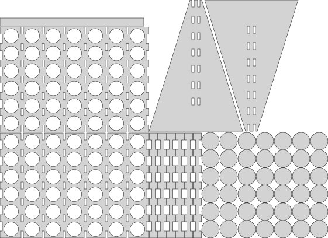

Laser Cut Connect Four
======================

This is a parametric laser cutting template for the classic Connect Four game
made with OpenSCAD.

## Building
Modify the parameters at the top of the OpenSCAD to suit your needs, export and
cut it.

To assemble, begin with the board spacers, these are the narrow pieces with
protrusions on either side. Glue them to the board faces on the inner rows.
After that has dried up, glue the board between the two stands. Finally, glue
the closing panel to the bottom of the board.

Note that Laser Cutters do not cut colors. To actually make the game playable,
cut half of the play pieces from a different material or apply some paint. :)

## Playing
The game is played by two players that each take turns. Each turn, a player
takes a play piece of his color and slides it into one of the 7 slots. The
player that can create a continuous line of 4 pieces either horizontally,
vertically or diagonally wins.
